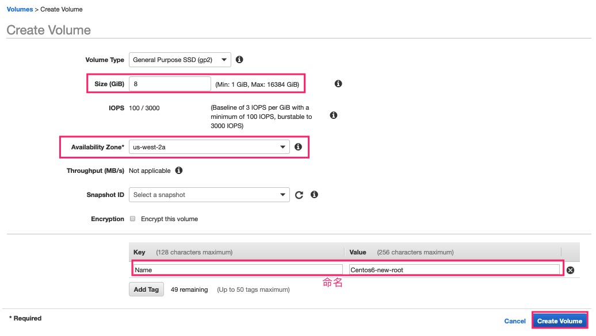

## 重点事情说三遍
**做任何线上操作前，一定记得备份！！！**

**做任何线上操作前，一定记得备份！！！**

**做任何线上操作前，一定记得备份！！！**

## 前言
EC2 5代机型非常好用：比之前型号的机型运行更快、价钱还更便宜，但是并不是所有 AMI 都可以与之匹配，此篇 Blog 重点就来聊聊如何把CentOS6的4代机型升级为5代机型。

要想CentOS6运行在5代机型，有两点需要注意
- 驱动：ENA网卡驱动和NVMe驱动
- 移除 Marketplace Code：因为CentOS6是从MarketPlace 选择的，所以要移除一些内容

接下的操作，我会围绕这上述注意点来进行

## 准备工作
1. 启动机器

    一台 m4.large 并且运行着 CentOS6（从 Marketplace 中选择的镜像），如：
    

2. 下载检查脚本。目的是检查当前镜像缺少的驱动

    脚本的官方地址
    ```
    https://github.com/awslabs/aws-support-tools/tree/master/EC2/C5M5InstanceChecks
    ```
    登陆 CentOS6 服务器，下载检查脚本
    ```
    # 切换到 root 用户
    [centos@ip-172-31-40-96 ~]$ sudo su -
    [root@ip-172-31-40-96 ~]# yum -y install wget

    # 下载脚本
    [root@ip-172-31-40-96 ~]# wget 'https://raw.githubusercontent.com/awslabs/aws-support-tools/master/EC2/C5M5InstanceChecks/c5_m5_checks_script.sh'
    [root@ip-172-31-40-96 ~]# chmod +x c5_m5_checks_script.sh

    # 执行脚本
    [root@ip-172-31-40-96 ~]# ./c5_m5_checks_script.sh 
    ------------------------------------------------

    OK     NVMe Module is installed and available on your instance
    cat: /etc/os-release: No such file or directory     # 这个报错可以略过


    ERROR  ENA Module is not available on your instance. 
            - Please install ENA module before changing your instance type to M5/C5. Look at the    following link for further guidance:
            > https://docs.aws.amazon.com/AWSEC2/latest/UserGuide/  enhanced-networking-ena.html#enhanced-networking-ena-linux


    OK     fstab file looks fine and does not contain any device names. 
    ```
    从执行脚本返回的结果看：当前操作系统缺少ENA网卡驱动。

## 安装ENA网卡驱动相关
1. 下载并安装驱动，一定在 root 用户环境
    ```
    [root@ip-172-31-40-96 ~]# yum -y install kernel-devel-$(uname -r) gcc git patch rpm-build wget

    # 下载ENA驱动
    [root@ip-172-31-40-96 ~]# wget https://github.com/amzn/amzn-drivers/archive/master.zip
    [root@ip-172-31-40-96 ~]# unzip master.zip

    # 编译
    [root@ip-172-31-40-96 ~]# cd amzn-drivers-master/kernel/linux/ena
    [root@ip-172-31-40-96 ena]# make

    # 拷贝 ena.ko 到模块目录并安装
    [root@ip-172-31-40-96 ena]# cp ena.ko /lib/modules/$(uname -r)/
    [root@ip-172-31-40-96 ena]# insmod ena.ko
    [root@ip-172-31-40-96 ena]# depmod
    [root@ip-172-31-40-96 ena]# echo 'add_drivers+=" ena "' >> /etc/dracut.conf.d/ena.conf
    [root@ip-172-31-40-96 ena]# dracut -f -v
    I: -rw-------. 1 root root 18763398 Mar 4 05:34 /boot/initramfs-2.6.32-754.10.1.el6.x86_64.img  # 我截取了返回的最后一行，这个路径在下面的验证流程中用的到

    # 验证 ENA驱动 是否包含在initramfs镜像中，使用上步生成的initramfs路径
    [root@ip-172-31-40-96 ena]# lsinitrd /boot/initramfs-2.6.32-754.10.1.el6.x86_64.img | grep ena.ko
    -rw-r--r--   1 root     root       162656 Mar  4 05:34 lib/modules/2.6.32-754.10.1.el6.x86_64/ena.ko   # 出现这行，就说明安装成功
    ```
2. 配置动态内核模块支持 (DKMS) 计划，以确保未来的内核升级期间包括驱动程序，先安装 EPEL 源
    ```
    [root@ip-172-31-40-96 ena]# yum install http://dl.fedoraproject.org/pub/epel/6/x86_64/epel-release-6-8.noarch.rpm
    ```

3. 安装 DKMS:
    ```
    [root@ip-172-31-40-96 ena]# yum -y install dkms
    [root@ip-172-31-40-96 ena]# VER=$( grep ^VERSION /root/amzn-drivers-master/kernel/linux/rpm/Makefile | cut -d' ' -f2 )
    [root@ip-172-31-40-96 ena]# cp -a /root/amzn-drivers-master /usr/src/amzn-drivers-${VER}

    # 生成DKMS配置文件
    cat > /usr/src/amzn-drivers-${VER}/dkms.conf <<EOM
    PACKAGE_NAME="ena"
    PACKAGE_VERSION="$VER"
    CLEAN="make -C kernel/linux/ena clean"
    MAKE="make -C kernel/linux/ena/ BUILD_KERNEL=\${kernelver}"
    BUILT_MODULE_NAME[0]="ena"
    BUILT_MODULE_LOCATION="kernel/linux/ena"
    DEST_MODULE_LOCATION[0]="/updates"
    DEST_MODULE_NAME[0]="ena"
    AUTOINSTALL="yes"
    EOM

    [root@ip-172-31-40-96 ena]# dkms add -m amzn-drivers -v $VER

    Creating symlink /var/lib/dkms/amzn-drivers/2.2.3/source ->
                 /usr/src/amzn-drivers-2.2.3

    DKMS: add completed.

    [root@ip-172-31-40-96 ena]# dkms build -m amzn-drivers -v $VER

    Kernel preparation unnecessary for this kernel.  Skipping...

    Building module:
    cleaning build area...
    make -j2 KERNELRELEASE=2.6.32-754.10.1.el6.x86_64 -C kernel/linux/ena/  BUILD_KERNEL=2.6.32-754.10.1.el6.x86_64....
    cleaning build area...

    DKMS: build completed.

    [root@ip-172-31-40-96 ena]# dkms install -m amzn-drivers -v $VER

    ena:
    Running module version sanity check.

    Good news! Module version 2.2.3g for ena.ko
    exactly matches what is already found in kernel 2.6.32-754.10.1.el6.x86_64.
    DKMS will not replace this module.
    You may override by specifying --force.
    Adding any weak-modules

    depmod...

    DKMS: install completed.
    ```

4. 使用 modinfo 命令确认存在 ENA 模块
    ```
    [root@ip-172-31-40-96 ena]# modinfo ena
    filename:       /lib/modules/2.6.32-754.10.1.el6.x86_64/ena.ko
    version:        2.2.3g
    license:        GPL
    description:    Elastic Network Adapter (ENA)
    author:         Amazon.com, Inc. or its affiliates
    retpoline:      Y
    srcversion:     0CFDCB6F1A754D70D6B225C
    alias:          pci:v00001D0Fd0000EC21sv*sd*bc*sc*i*
    alias:          pci:v00001D0Fd0000EC20sv*sd*bc*sc*i*
    alias:          pci:v00001D0Fd00001EC2sv*sd*bc*sc*i*
    alias:          pci:v00001D0Fd00000EC2sv*sd*bc*sc*i*
    depends:        
    vermagic:       2.6.32-754.10.1.el6.x86_64 SMP mod_unload modversions 
    parm:           debug:Debug level (0=none,...,16=all) (int)
    parm:           rx_queue_size:Rx queue size. The size should be a power of 2. Max value is 8K
     (int)
    parm:           force_large_llq_header:Increases maximum supported header size in LLQ mode to   224 bytes, while reducing the maximum TX queue size by half.
     (int)
    parm:           num_io_queues:Sets number of RX/TX queues to allocate to device. The maximum    value depends on the device and number of online CPUs.
     (int)
    ```

5. 以上执行完后，将此实例关机。然后在找一台可以运行 aws cli 命令行并且有操作 ec2 权限的机器，运行以下命令，目的是开启实例的ENA属性
    
    <font color='red'><b>关机时的注意事项：
    - 如果当前机器没有绑定弹性IP，机器一旦关机原IP就会被释放，而且无法找回；而且当前动态IP是无法配置成弹性IP的。所以在业务上线前一定要配置好弹性IP，弹性IP一旦被绑定在运行状态的机器上，是没有费用的；如果你申请了弹性IP没有绑定在运行状态的机器上，也就是闲置状态，才会有费用产生，这块一定要注意
    - 如果机器使用实例存储比如说 3代机型或者i系列机型，机器一旦被stop后，实例存储里的实例将会丢失，因为EC2一旦被stop后再次start，虚拟机将不会使用之前的宿主机，实例存储卷是在绑定宿主机上的，而不是和虚拟机绑定，和虚拟机产生绑定的是EBS卷。如果机器是 reboot(操作系统里reboot命令，或者控制台reboot)，虚拟机不会产生漂移，换句话说实例存储卷里的数据不会丢失，只要你的/etc/fstab配置自动挂载，否则需要再次手动挂载。</b></font>
  
    ```
    aws ec2 modify-instance-attribute --instance-id i-xxxx --ena-support --region us-west-2  # 当前实验机器在 Oregon，所以 Oregon 的Code为 us-west-2
    ```
    如需查询其他区域Code，[请点击此链接](https://docs.aws.amazon.com/zh_cn/AmazonRDS/latest/UserGuide/Concepts.RegionsAndAvailabilityZones.html)

    查看实例的ENA属性
    ```
    aws ec2 describe-instances --instance-ids i-xxxx --query "Reservations[].Instances[].EnaSupport --region xxx"
    ```

6. 将机器开机，登陆，并运行之前下载的脚本
    ```
    [centos@ip-172-31-40-96 ~]$ sudo su -
    [root@ip-172-31-40-96 ~]# ./c5_m5_checks_script.sh 
    ------------------------------------------------

    OK     NVMe Module is installed and available on your instance
    cat: /etc/os-release: No such file or directory   # 这个报错可以略过


    OK     ENA Module with version 2.2.3g is installed and available on your instance


    OK     fstab file looks fine and does not contain any device names. 

    ------------------------------------------------
    ```
    说明此台机器各项驱动都已正常

7. 我们关机，来更改实例类型，把实例类型改为 m5.large 
    
    
    在修改实例类型的时候，会报错。这就是我们上面说的第二个注意点：**移除 Marketplace Code**
    

## 移除 Marketplace Code
此问题的来源于：https://bugs.centos.org/view.php?id=6228。

接下来说一下解决方案

1. 先查看我当前实例根卷信息
    - 根据 instance-id 在 Volume 选项里进行筛选，可以查到与之关联的卷
    - 当前根卷：8GB
    - 当前卷的AZ：us-west-2a
    - 最好给当前根卷命名，日后不会混淆
   

2. 创建一个卷，和上述信息一样，并命名。点击 Create Volume
   

3. 会看到一个状态为 available ，名字为 Centos6-new-root 的卷:
   

4. 挂载到我们的实例上
    
    
    
   
5. 现在开机，并且检查挂载状态
    - 从AWS控制台看到的挂载状态
    
    - 从命令行看到的挂载状态
    ```
    [root@ip-172-31-40-96 ~]# fdisk -l

    Disk /dev/xvda: 8589 MB, 8589934592 bytes
    255 heads, 63 sectors/track, 1044 cylinders
    Units = cylinders of 16065 * 512 = 8225280 bytes
    Sector size (logical/physical): 512 bytes / 512 bytes
    I/O size (minimum/optimal): 512 bytes / 512 bytes
    Disk identifier: 0x000588e7

        Device Boot      Start         End      Blocks   Id  System
    /dev/xvda1   *           1        1045     8387584   83  Linux

    Disk /dev/xvdf: 8589 MB, 8589934592 bytes
    255 heads, 63 sectors/track, 1044 cylinders
    Units = cylinders of 16065 * 512 = 8225280 bytes
    Sector size (logical/physical): 512 bytes / 512 bytes
    I/O size (minimum/optimal): 512 bytes / 512 bytes
    Disk identifier: 0x00000000
    ```
    其中 /dev/xvda 是根卷，/dev/xvdf 是我们后来挂载的卷

6. 格式化 /dev/xvdf 
    ```
    [centos@ip-172-31-40-96 ~]$ sudo su -
    [root@ip-172-31-40-96 ~]# mkfs -t ext4 /dev/xvdf
    ```

7. 拷贝root(/dev/xvda) 卷到 /dev/xvdf 。需要一定时间拷贝
    ```
    [root@ip-172-31-40-96 ~]# dd bs=1M if=/dev/xvda of=/dev/xvdf
    ```

8. 拷贝结束后，我们关机，对这两块硬盘做一次调换，也就是原来 /dev/xvdf 变为 /dev/xvda.
    - 8.1 在调换前，我们要注意一下 Root Device 的挂载路径，**当前CentOS的为 /dev/sda1，这个路径信息非常关键**
    

    - 8.2 实例关机状态下，卸载与之实例相关的卷，因为当前实例只有这两个要调换的卷，所以都都要卸载，如果您那边有类似于 /dev/sdc /dev/sdd 的数据卷，其实是无需卸载的。
    
    

    - 8.3 选择标签为 **centos6-new-root 的卷(起名字的好处)**， 就是原来 /dev/xvdf 进行挂载，挂载点为 **/dev/sda1**
    
    
    

9. 切换回 instance 页面，我们之前方法 进行实例类型修改，然后启动实例，
    
    可以看到，实例类型已经修改，而且启动成功，之前的 /dev/xvda 基本上没有用了。

10. 登陆服务器查看
    ```
    [root@ip-172-31-40-96 ~]# df -h
    Filesystem      Size  Used Avail Use% Mounted on
    /dev/nvme0n1p1  7.8G  1.1G  6.4G  14% /
    tmpfs           3.7G     0  3.7G   0% /dev/shm

    [root@ip-172-31-40-96 ~]# lscpu 
    Architecture:          x86_64
    CPU op-mode(s):        32-bit, 64-bit
    Byte Order:            Little Endian
    CPU(s):                2
    On-line CPU(s) list:   0,1
    Thread(s) per core:    2
    Core(s) per socket:    1
    Socket(s):             1
    NUMA node(s):          1
    Vendor ID:             GenuineIntel
    CPU family:            6
    Model:                 85
    Model name:            Intel(R) Xeon(R) Platinum 8175M CPU @ 2.50GHz
    Stepping:              4
    CPU MHz:               2500.000
    BogoMIPS:              5000.00
    Hypervisor vendor:     KVM
    Virtualization type:   full
    L1d cache:             32K
    L1i cache:             32K
    L2 cache:              1024K
    L3 cache:              33792K
    NUMA node0 CPU(s):     0,1
    ```
    可以使用同样的命令，查看跑在4代之前的实例状态

11. 为了方便，我们可以为当前的实例做镜像
     
     